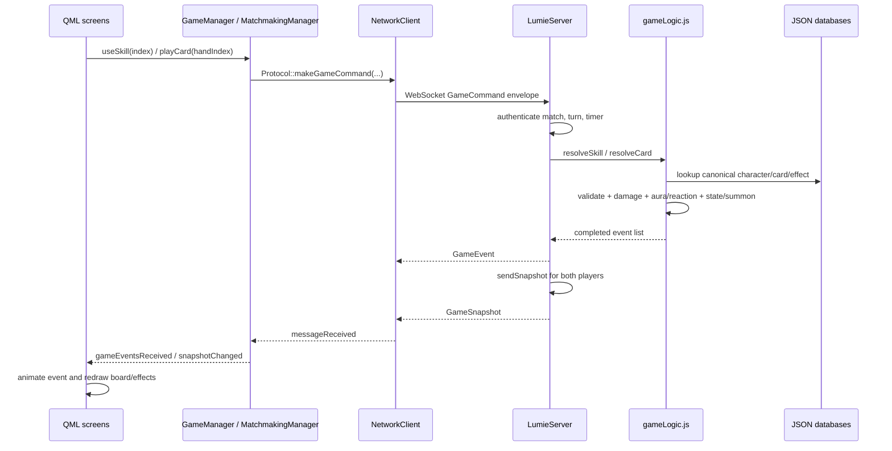

# LumieTCG

LumieTCG is a desktop trading card game inspired by Genshin Impact’s Genius Invokation TCG, built with **C++ and Qt 6 / QML**. It combines character-based battles and deck building with a custom Elemental Point resource system.

## Gameplay

Instead of rolling elemental dice, players start each round with **10 Elemental Points** to spend on actions. Cards and effects can modify these resources.

- Battle decks contain **3 unique characters and 30 cards**, with up to **3 copies** of each card.
- Characters, skills, equipment, support cards, states, and summons are described in JSON.
- The battle interface displays HP, Energy, Elemental Points, timers, weather, and action previews using server snapshots.

See [Battle rules and editable data](docs/battle-rules.md) for detailed mechanics and controls. Its server implementation and test references require the separate backend source.

## Online Gameplay

- Can play online now

## Core Gameplay Direction

LumieTCG is inspired by Genshin Impact's Genius Invokation TCG, but it is NOT intended to copy its rules exactly.

## Elemental Point System

The traditional dice system is removed.

Each player starts each round with:

    10 Elemental Points

Players can spend Elemental Points to perform actions.

Players may gain additional Elemental Points through specific support cards or effects.

Examples:

- Lose 2 points every round → gain 2 points later
- Sacrifice HP from a card/character → gain Elemental Points
- Other future card effects may modify Elemental Points

The Elemental Point system is intended to become one of the main strategic resources of the game.

## Weather System

The intended design:

- Each match randomly selects 3 weather conditions.
- Weather changes every 2 rounds.
- Each weather condition provides a special gameplay effect.
- Weather exists as a future method of changing the metagame and encouraging different deck strategies.

Example future concepts:

- Pyro-related weather
- Cryo-related weather
- Healing-related weather
- Elemental cost modification
- Damage modification
- Energy modification

## Build and run

### Requirements

- A C++ compiler supported by your Qt installation
- CMake 3.16 or newer
- Qt 6.2 or newer, including Qt Quick, QML, Qt Quick Controls, Qt SQL, and Qt WebSockets
- The Qt SQLite driver for local storage
- Ninja when using the commands below

Linux is the current development platform. You can open `CMakeLists.txt` in Qt Creator, select a desktop Qt kit, and build and run the `applumieTcg` target.

Alternatively, from the repository root:

```bash
cmake -S . -B build-local -G Ninja -DCMAKE_PREFIX_PATH=/path/to/Qt/6.x/gcc_64
cmake --build build-local
./build-local/applumieTcg
```

Replace the Qt path with your installation directory. Omit `CMAKE_PREFIX_PATH` if CMake already finds Qt.

### Server connection

The client currently defaults to `wss://lumietcgserver.onrender.com/ws`. Override it without rebuilding by setting `LUMIETCG_SERVER_URL`:

```bash
LUMIETCG_SERVER_URL=ws://127.0.0.1:14095 ./build-local/applumieTcg
```

This local example requires a compatible backend listening on port `14095`. In Qt Creator, set the variable in the project’s Run Environment. Use `ws://` or `wss://` URLs. Startup and the reconnect button use the configured endpoint.

The client exchanges JSON messages with `type` and `payload` fields. It sends player actions and displays server snapshots; the server is responsible for validating online battle actions and resolving game state.

## Project structure

```text
lumieTcg/
├── assets/           # Images and visual resources
├── json/             # Cards, characters, states, and summons
├── qml/
│   ├── Components/   # Reusable UI and battle components
│   ├── Core/         # Theme, shared UI helpers, and scene management
│   └── Screens/      # Application screens
├── src/
│   ├── Core/         # Shared types, events, and snapshots
│   ├── Data/         # Game databases and asset resolution
│   ├── Managers/     # Accounts, decks, game flow, and matchmaking
│   ├── Models/       # Data exposed to the UI
│   └── Network/      # WebSocket transport and protocol
├── docs/             # Gameplay documentation
├── App.cpp           # Application entry point
└── CMakeLists.txt    # Qt application build configuration
```

C++ handles client data, persistence, networking, and application state. QML handles presentation, interaction, and animation. Navigation uses the existing `SceneManager` and `StackView`.

Game content uses stable IDs rather than image paths. The JSON files are embedded as Qt resources, so rebuild the client after changing them. Keep client data compatible with the backend used for online play.

## Current Platform

Linux / Desktop

The project should remain cross-platform where reasonably possible.

# Important existing systems include:

## Core

Contains shared game types, enums, events and snapshots.

Examples:

- GameTypes
- GameEvent
- GameSnapshot
- Enums
- EnumUtils

---

## Data

Contains static game data.

Examples:

- CardDatabase
- CharacterDatabase
- AssetResolver

The Data layer should describe game content.

It should not become responsible for UI.

---

## Managers

Managers control high-level systems.

Important managers:

- AuthManager
- DeckManager
- GameManager
- MatchmakingManager
- AppManager
- AssetManager

Managers should expose clean APIs to QML when necessary.

---

## Models

Models represent data exposed to the UI/game systems.

Examples:

- CardModel
- CharacterModel
- PlayerModel
- BoardModel

---

## Network

Contains networking infrastructure.

Examples:

- NetworkClient
- Protocol
- MessageRouter
- RealtimeTransport

The network layer exists now because the project is intended to become online later.

However, online multiplayer is NOT the current priority.

---

## Authentication

Authentication currently uses a local SQLite database.

Current concept:

    AuthManager
        |
        v
    users.sqlite
        |
        +-- users

The current implementation is intentionally local.

DO NOT replace the local authentication system with a server implementation unless explicitly requested.

The architecture should remain easy to migrate to online authentication later.

## Deck System

Each player can have a maximum of:

    5 decks

Each deck can contain:

    Maximum 3 characters
    Maximum 30 cards

Deck data should contain:

- Deck ID
- Deck name
- Character IDs
- Card IDs

Example:

    Deck
    ├── id
    ├── name
    ├── characters[]
    └── cards[]

The DeckManager is responsible for:

- Creating decks
- Deleting decks
- Renaming decks
- Loading decks
- Saving decks
- Adding/removing characters
- Adding/removing cards
- Validating deck rules

---

Card Data

Cards should be represented using stable IDs rather than hard-coded asset paths.

For example:

    "kamisato_ayaka"
    "jueyun_guoba"
    "paimon"

Asset paths are presentation details.

Game logic should operate on IDs/data rather than directly depending on image filenames.

---

## Characters

Characters should eventually contain structured data such as:

- ID
- Name
- Element
- HP
- Skills
- Energy
- Statuses
- Talents
- Other gameplay properties

Character data should remain separated from UI.

---

## Summons

Summons are gameplay entities.

A summon should eventually be represented by structured data rather than being treated only as an image.

Potential data:

- ID
- Duration
- Trigger condition
- Damage
- Element
- Effects
- Number of usages

The summon system should be extensible.

Do not hard-code every summon into unrelated battle/UI code.

---

## Battle System

The battle system is one of the most important long-term systems.

The battle engine should eventually be independent from QML presentation.

Conceptually:

    Player Action
        |
        v
    GameManager / Battle Logic
        |
        v
    Validate Action
        |
        v
    Update Game State
        |
        v
    GameSnapshot
        |
        v
    QML
        |
        v
    Visual Update

## QML should display the state rather than become the source of truth for game rules.

## Definition of Success

The project should eventually become:

- A polished Qt/QML TCG
- Visually inspired by Genshin
- Strategically different through its Elemental Point system
- Extensible through cards, characters, summons and future weather
- Playable locally
- Account-aware
- Deck-builder focused
- Architecturally ready for online multiplayer
- Server-authoritative when online
- Well-design animation and visual (not implement)

## Server gameplay guide

### Authoritative state

The Node.js WebSocket server is authoritative: clients only send an index and target. Never trust a cost, damage value, card name, or skill name supplied by a client. `LumieServer.matches` is a `Map<matchId, match>`; obtain a match with `this.matches.get(payload.matchId)`. A match owns `sockets`, `players`, turn/round timers and weather. The player for a socket is found with `const playerIndex = match.sockets.indexOf(socket)` and `const player = match.players[playerIndex]`; the opponent is `match.players[1 - playerIndex]`.

Each player contains `characters`, `deck`, `hand`, `states`, `summons`, `elementPoints`, and `activeCharacterIndex`. Each character contains HP, Energy, elemental `applications`, and `ultimateUsed`. `sendSnapshot()` is the single projection sent to both clients and deliberately hides the opponent's hand IDs.

### Elements, aura, and reactions

Data uses uppercase element names: `PYRO`, `HYDRO`, `CRYO`, `ELECTRO`, `DENDRO`, `ANEMO`, `GEO`, `PHYSICAL`, and `PIERCE`. The five aura elements can be attached to a target. A different compatible aura resolves a reaction, clears the old aura, applies reaction bonus damage, and emits an `ElementalReaction` event. Physical, Geo, Anemo, and piercing damage do not leave an aura. Piercing damage targets standby characters.

Costs in JSON may combine a specific element, `ANY`/`SAME`, and `ENERGY`. `pointCost()` totals non-Energy dice/element points. Energy is checked separately. Normal attacks and elemental skills restore one Energy; bursts consume their Energy requirement and set `ultimateUsed`, so that character cannot burst again in the match.

### JSON-driven actions

- `resolveSkill(match, playerIndex, command)` reads the active character, converts `skillIndex` to the canonical skill name from `character.json`, validates server-side costs and the one-burst limit, resolves damage/aura/reactions, then creates states and summons.
- `resolveCard(match, playerIndex, command)` converts `handIndex` to a card ID from the server-owned hand, looks it up in `card.json`, validates cost, removes exactly that hand entry, and resolves damage, healing, application, Energy, state, summon, or an attached `use_skill`. There is no per-match card-use limit.
- `availability(player)` creates the per-skill `available` flags in snapshots. The QML client uses these flags to darken actions blocked by element points, Energy, turn ownership, or the burst limit.
- `deckValidator.js` enforces each card's `deck_limit.character` before a deck enters a match. The deck-builder also displays this requirement for immediate feedback.

### Client/server interaction map



Connection flow is `AuthRequest` → `SubmitDeck`/`DeckValidationResult` → `MatchmakingStart` → `MatchFound` → deck selection → `GameStarted`. **Connect to server again** closes the existing socket and reopens the configured `networkClient.serverUrl` after a short delay.

## AI usage

AI was used to assist with:

- Writing JSON game data.
- Simplifying the project structure based on the original idea.
- Writing documentation.
